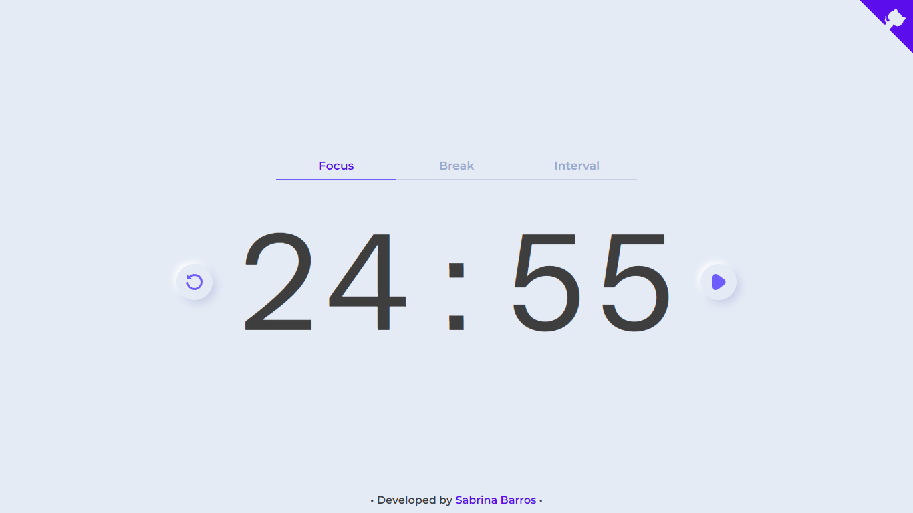

# Pomodoro Timer ⏰

An intuitive timer built with React, following the Pomodoro technique 🍅



> If you found this project helpful or useful, please consider giving it a ⭐

## Development 🔧

### Getting started

- Clone this repository:

```shell
$ git clone git@github.com:SabrinaBarros/pomodoroTimer.git
```
```shell
$ cd pomodoroTimer
```

- And install all dependencies:

```shell
$ npm install
```

- Start the project:

```shell
$ npm run dev
```

## Contributing 💌

This project was created as a personal initiative to develop my front-end skills and share my work with the community. It is constantly evolving and always open to contributions and constructive feedback. If you would like to contribute to the project, feel free to check the [CONTRIBUTING](CONTRIBUTING.md) file for more information. 

## License 📃

[MIT License](./LICENSE) © [Sabrina Barros](https://github.com/SabrinaBarros)

<hr>

I hope my project is useful in improving your productivity. If you have suggestions or encounter issues, please feel free to contribute or report issues. Enjoy your Pomodoro sessions! 🍅✨